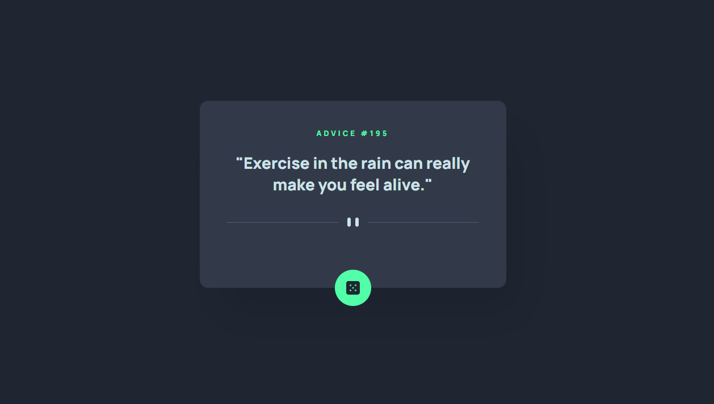

# Advice generator app

## Welcome! 👋

This is my solution to the [Advice generator app challenge on Frontend Mentor](https://www.frontendmentor.io/challenges/advice-generator-app-QdUG-13db).

## Overview

### The challenge

Your users should be able to:

- View the optimal layout for the app depending on their device's screen size
- See hover states for all interactive elements on the page
- Generate a new piece of advice by clicking the dice icon

My challenge is to build out this advice generator app using the [Advice Slip API](https://api.adviceslip.com) and get it looking as close to the design as possible.

### Screenshot

### Built with

- JavaScript
- HTML5 markup
- SCSS/CSS
- Flexbox

## What I learned

First time fetching data from an API.